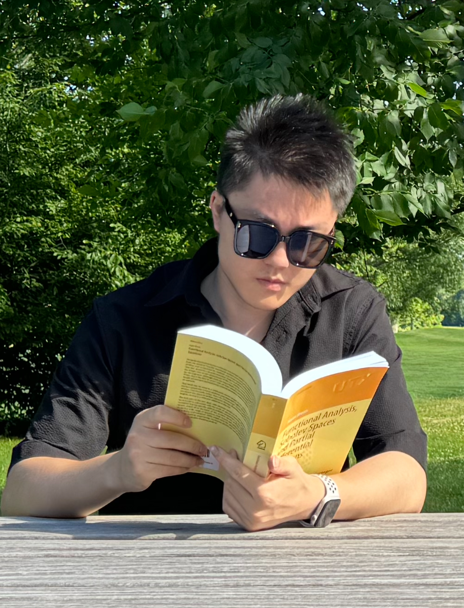

# Welcome to My GitHub Profile

 <!-- Optional: Add a custom header image -->

## About Me

Hello! I'm **Jiahua Song**, a passionate Applied Mathematics Student with a strong interest in Numerical Analysis, PDE, Machine Learning, Computational Fluid Dynamics. I am currently pursuing a Master's degree in Applied Mathematics at Columbia University.

- 🔭 **Current Research**: I am working on Reduced Order Model on Radiative Transfer Equation.
- 🌱 **Currently Learning**: Analytical Method of PDE, Numerical Analysis of PDE.
- 💬 **Ask Me About**: Operator Learning, Inverse Problem, PINN, PDE, SDE, Numerical Analysis/Algebra.
- 📫 **How to Reach Me**: You can contact me via js6409@columbia.edu.

## Research Interests

- Research Interest 1 Operator Learning, PDE Solvers, PDE Discovery, Data-Driven Methods. 

## Projects

### Optimal Basis for Radiative Transfer Equation (Link to Project Repo)

[Brief description of the project. What does it do? Why is it important? What technologies are used?]

### [Another Project Name](Link to Project Repo)

[Brief description of another project.]

## Publications

- **[Publication Title](Link to Publication)**, Journal Name, Year.
  - [Brief description of the publication or your role in the research.]

## Education

- **Master of Science in Applied Mathematics** - Columbia University, Aug 2023 - May 2025
- **Bachelor of Science in Applied Mathematics & Statistics** - University of Connecticut, Aug 2019 - May 2023

## Skills

- **Programming Languages**: Python, MATLAB, R, SAS, SQL
- **Tools**: TensorFlow, Git, LaTex
- **Mathematical Methods**: FDM/FEM/FVM/Spectral Method

## Get in Touch

- **Email**: js6409@columbia.edu
- **LinkedIn**: [Your LinkedIn Profile](https://www.linkedin.com/in/jiahuasong7/)
- **Instagram**: [@YourTwitterHandle](https://www.instagram.com/pcprcjiahua.song/?hl=en)

---

Thank you for visiting my GitHub profile! I am always open to collaboration and discussions on any Applied Math topics. Feel free to reach out!
