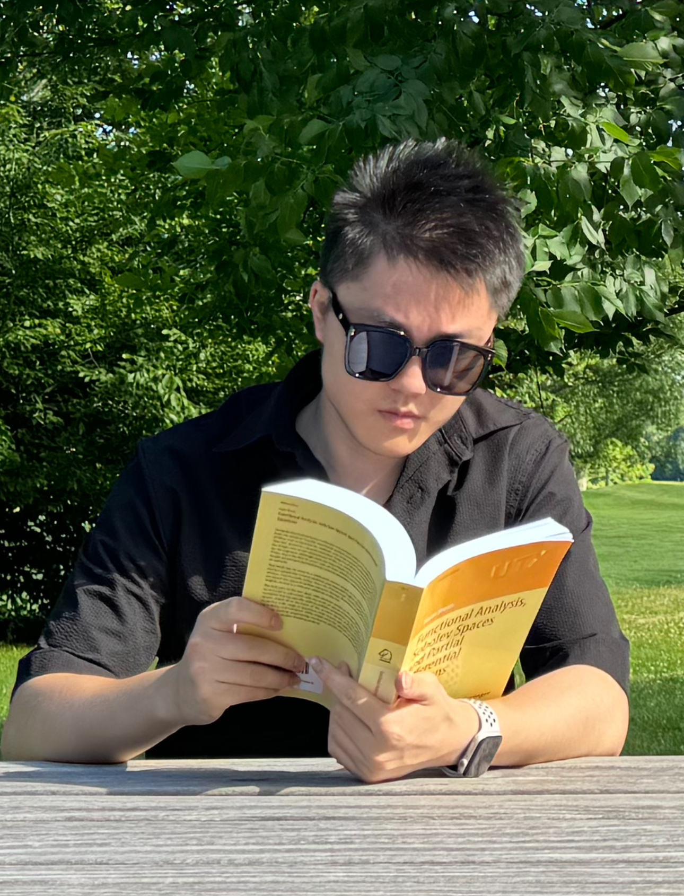

# Jiahua Song

## About Me

I am a Ph.D. student in Mathematics at **The University of Texas at Austin**, with interests in applied and computational mathematics. My research focuses on numerical methods, PDEs, scientific machine learning, multiscale modeling, reduced-order modeling, and generative models for scientific computing.

**My current work studies neural-network-based solvers for multiscale dynamical systems, with emphasis on structure-preserving technique, effective approximation.**

---

## Research Interests

My research interests lie at the intersection of **PDEs, numerical analysis, and machine learning**. In particular, I am interested in:

1. **Mathematical Foundations of Machine Learning for PDEs**
   Theory of neural networks and scientific machine learning, including approximation, optimization, generalization, structure, loss design, and stability for PDE-based problems.

2. **Multiscale Modeling and Structure-Preserving Solvers**
   Numerical and learning-based methods for multiscale dynamical systems, with attention to slow variables, effective dynamics, invariant structures, and efficient time integration.

3. **Generative Models for Scientific Computing**
   SDEs, probability flows, diffusion-type models, and generative methods for modeling, simulation, inverse problems, and uncertainty quantification.

4. **Reduced-Order Modeling and Operator Learning**
   Low-dimensional representation of high-dimensional PDE solutions, reduced basis methods, POD/ROM, neural operators, and data-driven solution operators.

Overall, my goal is to develop mathematically principled and computationally efficient methods for forward and inverse problems in scientific computing. They should be useful in industry and Academia. 

---

## Selected Research Projects
### Data-Driven Reduced-Order Model for Radiative Transfer Equation

**Supervisor: Kui Ren**
**Collaborators: Yinxi Pan, Shanyin Tong**

This project develops reduced-order models for the radiative transfer equation, focusing on the angular-averaged local density rather than the full phase-space solution. We use an integral formulation of isotropic radiative transport and construct a data-driven reduced basis from full-order simulations generated by upwind discretization, discrete ordinates, and source iteration. The resulting offline-online reduced model uses SVD-based basis selection to efficiently approximate solutions for new source functions, achieving significant computational savings while maintaining good accuracy in one- and two-dimensional numerical experiments.

### Operator Learning for Quasi-Linear Hyperbolic Systems

**Supervisor: Kui Ren**

This project develops a theoretical framework for learning solution operators of quasi-linear hyperbolic PDEs. Motivated by Roe’s linearization and characteristic decomposition, the method learns Roe-average states and characteristic variables, then combines PINN and Fourier Neural Operator components to solve the decoupled characteristic equations efficiently. The goal is to build structure-aware neural operators for high-dimensional hyperbolic systems with continuous or discontinuous initial data.

### Physics-Informed Neural Networks for PDE Discovery

**Supervisor: Sharon Di**

This project studies inverse problems for discovering PDEs from data using physics-informed neural networks and symbolic regression. I proposed the **Nontrivial Transformation Method**, which searches for hidden relations among candidate PDE expressions under suitable transformations. The method combines PINN-based modeling with PEQL and SGA-PDE to identify interpretable governing equations, and was tested on benchmark examples such as the heat equation.

### Stability Analysis of LMM

**Supervisor: Qiang Du**

This project studies the stability of numerical time-integration methods for large ODE systems arising from scientific computing and semi-discretized PDEs. Motivated by Eitan Tadmor’s numerical-range-based stability theory for Runge-Kutta methods (https://arxiv.org/abs/2312.15546), I investigated how this framework can be extended beyond classical RK schemes. In particular, I partially extended the same stability technique to linear multistep methods, aiming to understand dimension-independent stability criteria for high-dimensional dynamical systems.

---

## Education

* **Ph.D. in Mathematics**, The University of Texas at Austin, 2025–Present
* **M.S. in Applied Mathematics**, Columbia University, 2023–2025
* **B.S. in Applied Mathematics and Statistics**, University of Connecticut, 2019–2023

---

## CPU

* **Programming**: Python, MATLAB
* **Packages**: PyTorch, neural operators, DeepXDE
* **Mathematics**:
  * M381C: Real Analysis [[DONE](./M381C.pdf)] -- M381D: Complex Analysis [Plan]

  * M383C: Applied Math I [[DONE](./M383C.pdf)] -- M383D: Applied Math II [Almost]

  * M385C: Theory of Probability I [Working] -- M385D: Theory of Probability II [Working]

  * M387C: Numerical Methods [[DONE](./M387C.pdf)] -- M387D: Numerical PDE [Working]

  * [Not in the Plan] M380C: Algebra I -- M380D: Algebra II
  * [Not in the Plan] M382C: Algebraic Topology -- M382D: Differential Topology

* **Topics**:
  * Analysis: PDE I [Plan], PDE II [Plan]
  * Applied and computational mathematics: Mathematics in Deep Learning [Plan], Foundational techniques in Machine Learning and Data Science [Plan]
  * Probability: Stochastic Processes I [Plan], Topics in Stochastic Analysis [Plan]
  * Algebra and dynamics: Dynamical Systems [Plan]

---

## Contact

I am always open to discussions and collaborations in applied mathematics, scientific computing, numerical PDEs, and machine learning for scientific problems.

* **Email**: [jiahua.song@utexas.edu](mailto:jiahua.song@utexas.edu)
* **LinkedIn**: [linkedin.com/in/jiahuasong7](https://www.linkedin.com/in/jiahuasong7/)

---

<table>
<tr>
<td>

### Copyright & Usage

© 2026 Jiahua Song. All rights reserved.

This repository is shared for viewing and academic reference only. Commercial use, redistribution, modification, or incorporation into products, services, or business materials requires prior written permission from the author.

For permission requests, please contact: [jiahua.song@utexas.edu](mailto:jiahua.song@utexas.edu).

</td>
</tr>
</table>

